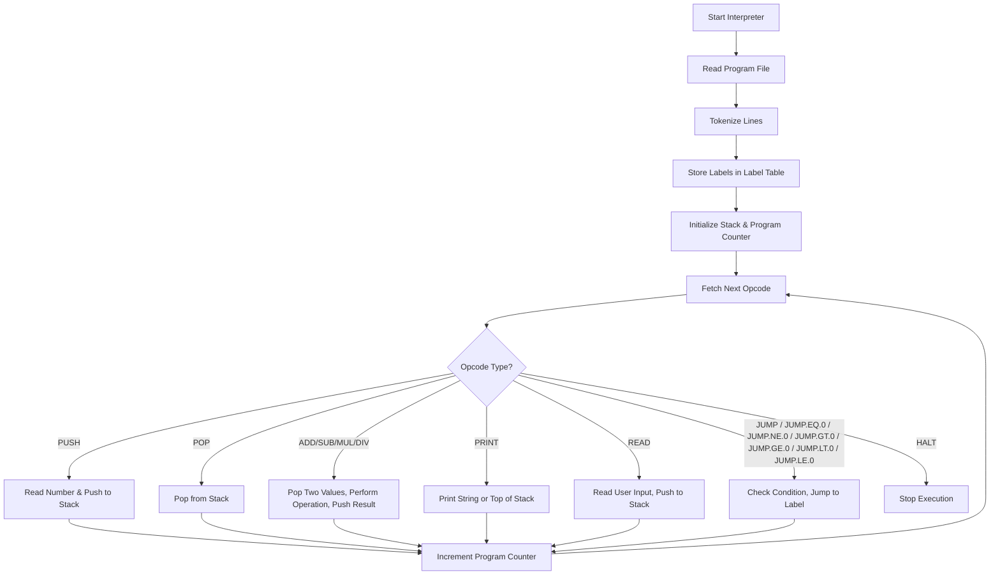

[![Changelog][changelog-badge]][changelog]
[![License][license-badge]][license]

<!-- Files -->
[changelog]: ./CHANGELOG.md
[license]: ./LICENSE
<!-- Badges -->
[changelog-badge]: https://img.shields.io/badge/changelog-0.0.1-blue.svg
[license-badge]: https://img.shields.io/badge/license-DWYW--WC-green.svg

# My Own Programming Language

**MOPLang or MOPL for short.**

- Status: In Development
- Version: 0.0.1
- Last Update: 2025-08-09 (YYYY-MM-DD)

Definitions:

- CCS: Completes Current Spec
- VLSC: Version since Last Spec Completion

**Interpreters:**

| Language | Status | CCS? | VLSC  |
| -------- | ------ | ---- | ----- |
| Python   | Stable | Yes  | 0.0.1 |
| Go       | Stable | Yes  | 0.0.1 |

**Compilers:**

| Language    | Status      | CCS?        | VLSC        |
| ----------- | ----------- | ----------- | ----------- |
| Not Started | Not Started | Not Started | Not Started |

## Goals

Simple Language to learn to create Language Design, Interpreters and Compilers with. An eventual goal would also be creating interesting, fun programs with MOPlang.

## How Programming Languages Work

Programming languages serve as a bridge between human-readable instructions and machine-executable code. Understanding how they work provides valuable context in our day to day as software engineers.

### Programming Languages Overview

Programming languages, at their core, are remarkably similar to natural languages. They're essentially formal systems built upon an alphabet (the symbols you can use), a syntax (the rules for arranging those symbols), and semantics (the meaning behind those arrangements). The key distinction lies in their purpose: while human languages facilitate communication among people, programming languages enable humans to communicate instructions to / communicate with machines.

### The Translation Problem

Computers only understand machine code. Which is nothing more than sequences of binary numbers that represent specific processor instructions. However, writing directly in machine code is extremely tedious and error-prone for humans. (Almost) No one wants to endlessly type 0 and 1 a gajillion times. Programming languages solve this translation problem by providing abstractions that are more intuitive for human reasoning while still being precise enough to convert into machine instructions.

This translation process involves several key concepts. First, there's the notion of abstraction levels. Higher-level languages like Python or JavaScript are further removed from machine code than lower-level languages like C or assembly. Second, there's the parsing process, where the language's syntax rules are used to break down source code into meaningful components that can be analyzed and processed. Finally, there's the actual translation mechanism, which transforms these parsed components into executable instructions.

### Interpreters vs Compilers

The translation from high-level code to machine-executable instructions happens through two primary approaches: interpretation and compilation.

**Interpreters** work by reading and executing source code line by line (or statement by statement) at runtime. Think of an interpreter as a real-time translator who listens to a speaker and immediately translates their words to the audience. Languages like Python, JavaScript, and Ruby typically use interpreters. When you run a Python script, the Python interpreter reads your code, parses it, and executes the corresponding machine instructions on the fly. This approach offers flexibility. You can modify code and see results immediately without a separate build step. But it comes with performance overhead since translation happens during execution.

**Compilers** take a different approach by translating the entire source code into machine code before execution. This is like having a translator work on a complete document beforehand, producing a fully translated version that can be read directly by the target audience. Languages like C, C++, and Rust use compilers. The compilation process produces an executable file containing machine code that can run directly on the target processor without needing the original source code or language tools. This typically results in faster execution since no translation overhead exists at runtime, but requires a separate build step whenever code changes.

Some languages blur these boundaries. For example, Java compiles to bytecode (an intermediate representation) which is then interpreted or just-in-time compiled by the Java Virtual Machine, while languages like C# use similar hybrid approaches.

## The Language Itself

The Idea is creating a language with basic syntax allowing for mathematical operations.

### Syntax

The syntax is defined in the EBNF grammar and can be found in [grammar.ebnf](./documentation/grammar.ebnf).

## Interpreter

The MOPLang interpreter is responsible for reading a `.mopl` program file, turning the read program it into tokens, and then executing those instructions step-by-step.

### How it works

1. Reading the Program
    - The interpreter takes the program file path as a command-line argument
    - It reads the file line-by-line, trimming whitespace
    - Any text after a `;` is ignored
2. Tokenization
    - Each line is split into parts:
        - The first part is the **opcode** (e.g., `PUSH`, `ADD`, ...)
    - Labels (e.g., `LOOP:`) are stored in a **label table** (`label_tracker`) mapping label names to their position in the program
    - For opcodes that require arguments (like `PUSH 5` or `PRINT "Hello"`), the argument is parsed and stored in the program list right after the opcode
3. Stack implementation
    - The interpreter uses a **stack** to store numbers
    - The stack supports:
        - `push(number)` — put a number on top
        - `pop()` — remove and return the top number
        - `top()` — read the top number without removing it
4. Execution Loop
    - The interpreter starts at the first instruction (`program_counter = 0`)
    - It reads the current opcode and executes it
    - For math operations (`ADD`, `SUB`, `MUL`, `DIV`):
      - Two numbers are popped from the stack
      - The operation is performed
      - The result is pushed back onto the stack
    - For `PRINT`:
      - If the argument is `TOP`, the top of the stack is printed
      - Otherwise, the given string is printed
    - For `READ`:
      - The interpreter waits for user input, converts it to a number, and pushes it onto the stack
    - For jumps (`JUMP.EQ.0`, `JUMP.GT.0`):
      - The top of the stack is checked
      - If the condition is true, the program counter jumps to the label's position
    - The loop continues until the `HALT` instruction is reached
5. Error Handling
    - Division by zero stops the program with an error message.
    - Invalid numbers or missing arguments also cause the interpreter to exit.

### Execution Flow Diagram



### Example Program

```mopl
; This program adds two numbers (5 and 3) and prints the result
PUSH 5
PUSH 3
ADD
PRINT TOP
HALT
```

Execution:

- Push 5 → stack: \[5\]
- Push 3 ⇾ stack: \[3, 5\]
- Add ⇾ pop 3 and pop 5, push 8 ⇾ stack: \[8\]
- Print top ⇾ outputs `8`
- Halt ⇾ program ends

## Testing Strategy for Interpreters

To ensure the correctness and reliability of the MOPLang interpreters, the goal is to utilize a comprehensive testing strategy, which tests every possible instruction.

### Test Structure Overview

This project employs a three-layer testing architecture:

1. Test Cases: Individual `.mopl` files with expected outcomes
2. Test Runner: Language-agnostic test orchestration
3. Test Harness: Per-language test execution wrapper

### Test Case Format

Each test consists of:

- `.mopl` file: The program to test
- `.expected` file: Expected stdout output
- `.input` file (optional): stdin input for READ operations
- `.error` file (optional): Expected error/exit code

For a single test case, all four files should have the same name.

#### Test Case Naming

Test cases are named as follows:

- `<test_name>.<extension>`, where `<test_name>` is the name of the instruction and `<extension>` is one of `.mopl`, `.expected`, `.input`, or `.error`.
  - If a instruction includes `.` in their name, it is replaced with `_` in the test case name.
- The test cases are organized by their instruction type, such as `stack_ops`, `control_ops`, etc
- The exception to that rule are special test cases, which are placed in `edge_cases`

## Known Issues

None so far :D

## TODO

- More language features
  - Introducing a variables table
  - Potentially adding a heap
  - More Arithmetics
  - More conditional jumps
- More mopl example programs
- Potentially add a badge showing the test results
- Better error handling in both interpreters
- Modularizing python & go interpreters
- Expand testing by adding edge case tests
- LSP for MOPLang
- Writing down more information and research
- Potentially more interpreter implementations in other languages
- Starting the whole compiler things
- Replace specific interpreter implementation documentation by general semantics document