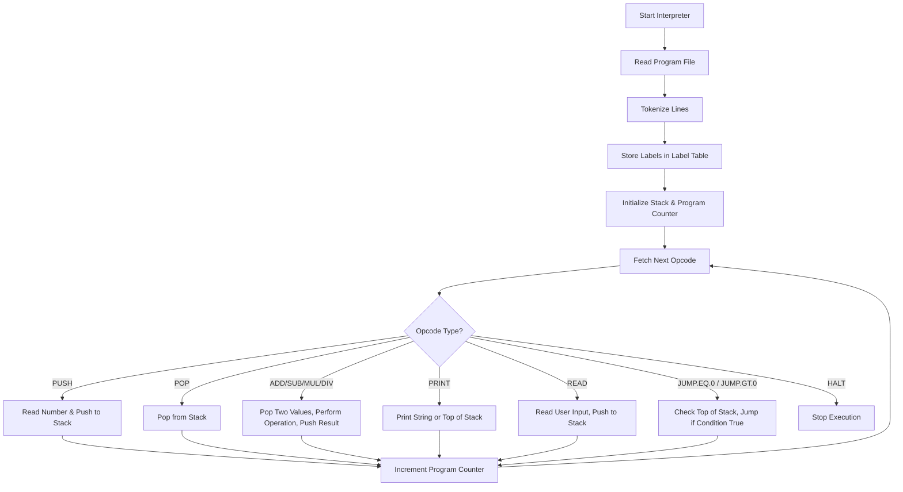

[![Changelog][changelog-badge]][changelog]
[![License][license-badge]][license]

<!-- Files -->
[changelog]: ./CHANGELOG.md
[license]: ./LICENSE
<!-- Badges -->
[changelog-badge]: https://img.shields.io/badge/changelog-0.0.1-blue.svg
[license-badge]: https://img.shields.io/badge/license-DWYW--WC-green.svg

# My Own Programming Language

**MOPLang or MOPL for short.**

- Status: In Development
- Version: 0.0.1
- Last Update: 2025-08-09 (YYYY-MM-DD)

Definitions:

- CCS: Completes Current Spec
- VLSC: Version since Last Spec Completion

**Interpreters:**

| Language | Status | CCS? | VLSC  |
| -------- | ------ | ---- | ----- |
| Python   | Stable | Yes  | 0.0.1 |
| Go       | Stable | Yes  | 0.0.1 |

**Compilers:**

| Language    | Status      | CCS?        | VLSC        |
| ----------- | ----------- | ----------- | ----------- |
| Not Started | Not Started | Not Started | Not Started |

## Goals

Simple Language to learn to create Interpreters and Compilers with.

## The Language itself

The Idea is creating a language with basic syntax allowing for mathematical operations.

### Syntax

The syntax is defined in the EBNF grammar and can be found in [grammar.ebnf](./documentation/grammar.ebnf).

## Interpreter

The MOPLang interpreter is responsible for reading a `.mopl` program file, turning the read program it into tokens, and then executing those instructions step-by-step.

### How it works

1. Reading the Program
    - The interpreter takes the program file path as a command-line argument
    - It reads the file line-by-line, trimming whitespace
    - Any text after a `;` is ignored
2. Tokenization
    - Each line is split into parts:
        - The first part is the **opcode** (e.g., `PUSH`, `ADD`, ...)
    - Labels (e.g., `LOOP:`) are stored in a **label table** (`label_tracker`) mapping label names to their position in the program
    - For opcodes that require arguments (like `PUSH 5` or `PRINT "Hello"`), the argument is parsed and stored in the program list right after the opcode
3. Stack implementation
    - The interpreter uses a **stack** to store numbers
    - The stack supports:
        - `push(number)` — put a number on top
        - `pop()` — remove and return the top number
        - `top()` — read the top number without removing it
4. Execution Loop
    - The interpreter starts at the first instruction (`program_counter = 0`)
    - It reads the current opcode and executes it
    - For math operations (`ADD`, `SUB`, `MUL`, `DIV`):
      - Two numbers are popped from the stack
      - The operation is performed
      - The result is pushed back onto the stack
    - For `PRINT`:
      - If the argument is `TOP`, the top of the stack is printed
      - Otherwise, the given string is printed
    - For `READ`:
      - The interpreter waits for user input, converts it to a number, and pushes it onto the stack
    - For jumps (`JUMP.EQ.0`, `JUMP.GT.0`):
      - The top of the stack is checked
      - If the condition is true, the program counter jumps to the label's position
    - The loop continues until the `HALT` instruction is reached
5. Error Handling
    - Division by zero stops the program with an error message.
    - Invalid numbers or missing arguments also cause the interpreter to exit.

### Execution Flow Diagram



### Example Program

```mopl
; This program adds two numbers (5 and 3) and prints the result
PUSH 5
PUSH 3
ADD
PRINT TOP
HALT
```

Execution:

- Push 5 → stack: \[5\]
- Push 3 ⇾ stack: \[3, 5\]
- Add ⇾ pop 3 and pop 5, push 8 ⇾ stack: \[8\]
- Print top ⇾ outputs `8`
- Halt ⇾ program ends

## Known Issues

None so far :D

## TODO

- More language features
- More mopl example programs
- Find out if $\mathbb{Q}$ is the right type for numbers there
- Better error handling in both interpreters
- Modularising python & go interpreters
- Writing down more information and research
- Starting the whole compiler things
